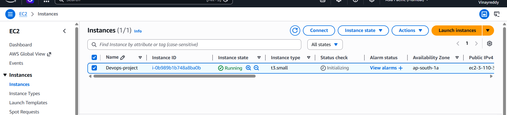
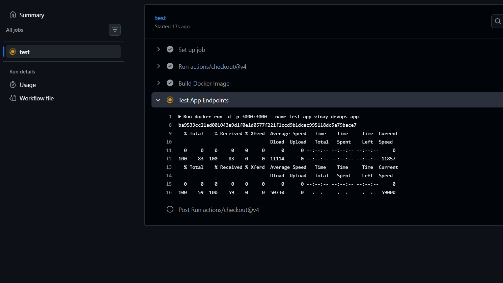
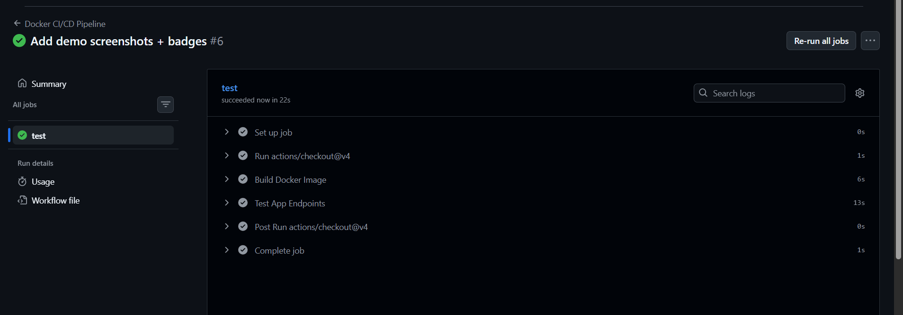

# 🚀 Vinay DevOps Job Project

## 📸 Proof of Work

| Docker Container | GitHub Actions CI | App Live |
|------------------|-------------------|----------|
|  |  |  |

## Endpoints
- `GET /` → Custom JSON message  
- `GET /health` → Status + timestamp

**Live Demo**: http://YOUR-ACTUAL-EC2-PUBLIC-IP:3000/health

**Tech Stack**: Node.js • Docker • GitHub Actions • AWS EC2 Free Tier

**Live Demo**: http://3.110.30.107:3000/health

